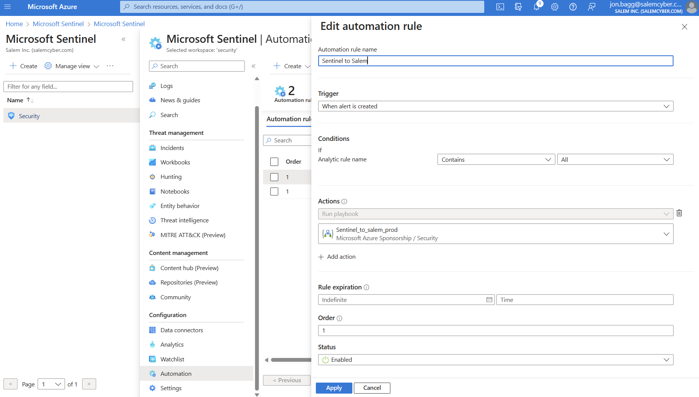
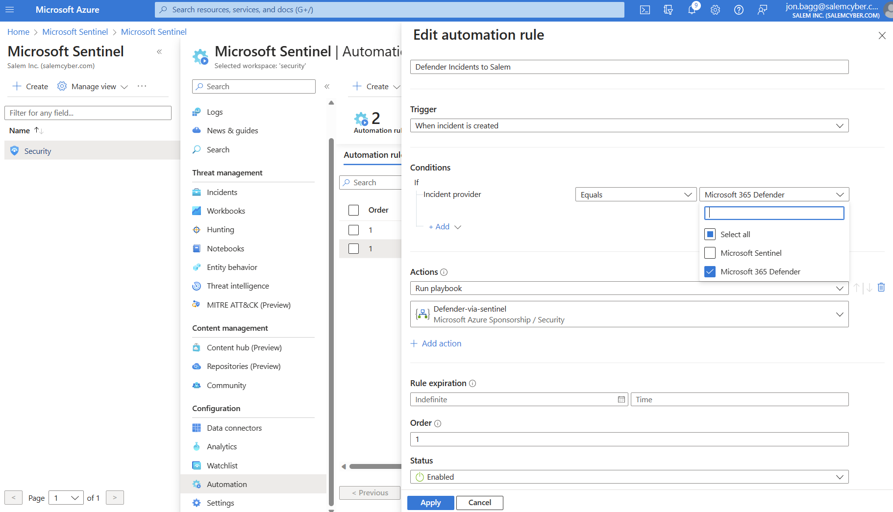
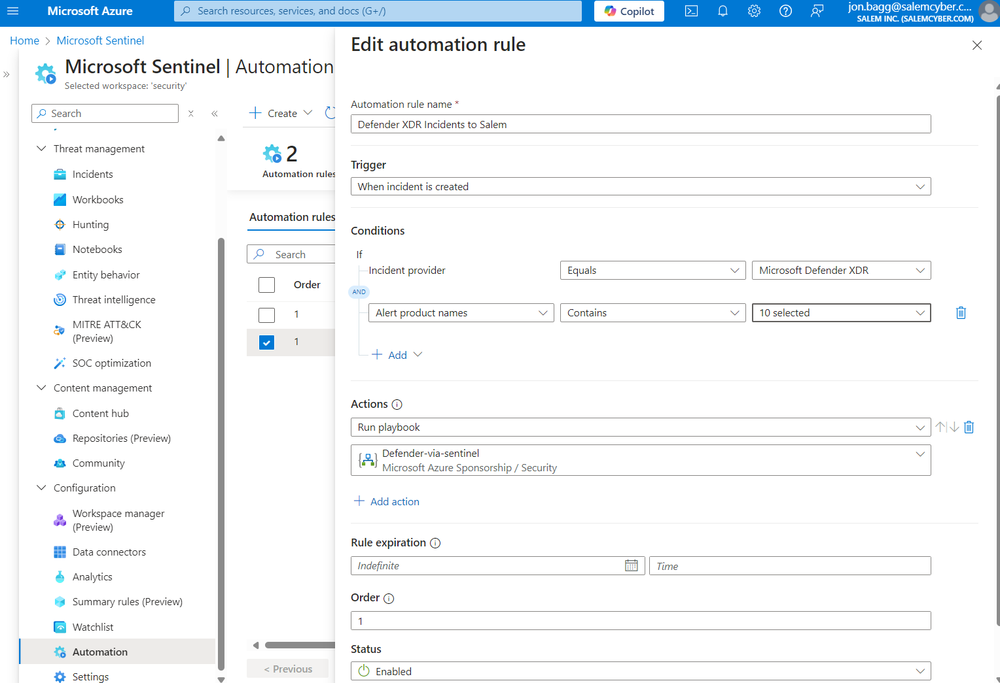

# Integration Salem with Microsoft Sentinel

## Prerequisites

* Permissions: you must have the Azure RBAC role "Microsoft Sentinel Automation Contributor", in the resource group you are deploying this integration to in order to use these playbooks within Azure Sentinel

## Integration for native Sentinel Alerts

This integration is for alerts created in Microsoft Sentinel by Sentinel Analytics.  Skip to the next section to collect alerts forwarded to Sentinel from Microsoft Defender

Integration includes:

* a playbook (logic app) that can send Microsoft Sentinel alerts to Salem.
* a workbook to view Salem alert analysis metrics from Sentinel log search.  This requires configuring Salem to send alert analysis logs to Sentinel's Azure analytic workspace

### Deploy Playbook

The below link will deploy a new Azure logic app configured to send Sentinel alerts to Salem for analysis

[Deploy to Azure](https://portal.azure.com/#create/Microsoft.Template/uri/https%3A%2F%2Fraw.githubusercontent.com%2FSalemCyberAI%2FUtils%2Fmain%2FMS%2520Sentinel%2FPlaybooks%2FSendAlertToSalem%2Fazuredeploy\.json)

### Update Event Hub network settings

The consumption plan log apps (which this is) use a fixed set of public IP addresses and you must update the network configuration of the Salem Event Hub to allow connections from these IPs.  You can find the IP ranges based on the region you deployed your logic app into, [here](https://learn.microsoft.com/en-us/connectors/common/outbound-ip-addresses)

If you want to use vNet integration or private endpoints to communicate between the logic app and the Salem event hub, you need to create a standard plan logic app.  Only the standard plan apps have advanced networking features.

### Authorize the API connection

When deploying the playbook, a new API connection resource was created and needs to be authorized.

1. Find the API connection created by deploying the Defender APT integration.  The API connection will be called 'Salem-MicrosoftSentinel'

2. From the API connection resource, select Edit API connection and then select 'authorize'

### Configure Sentinel Automation

You will need to configure a new incident trigger automation from the Microsoft Sentinel resource in the Azure portal.  

## Integration for Defender For Endpoint Alerts forwarded to Microsoft Sentinel

Microsoft Sentinel users have the option to connect Micorosft 365 Defender (which includes Defender for Endpoint) to Sentinel.  You may want to use Sentinel automation to forward Defender alerts to Salem.  This integration allows you to do that.

### Deploy Playbook

The below link will deploy a new Azure logic app configured to send Defender alerts to Salem for analysis

[Deploy to Azure](https://portal.azure.com/#create/Microsoft.Template/uri/https%3A%2F%2Fraw.githubusercontent.com%2FSalemCyberAI%2FUtils%2Fmain%2FMS%2520Sentinel%2FPlaybooks%2FDefenderAlertsToSalem%2Fazuredeploy\.json)

### Update Event Hub network settings

The consumption plan log apps (which this is) use a fixed set of public IP addresses and you must update the network configuration of the Salem Event Hub to allow connections from these IPs.  You can find the IP ranges based on the region you deployed your logic app into, [here](https://learn.microsoft.com/en-us/connectors/common/outbound-ip-addresses)

If you want to use vNet integration or private endpoints to communicate between the logic app and the Salem event hub, you need to create a standard plan logic app.  Only the standard plan apps have advanced networking features.

### Authorize the API connection

When deploying the playbook, a new API connection resource was created and needs to be authorized.

1. Find the API connections created by deploying the Defender APT integration.  The API connections will be called 'Salem-MicrosoftSentinel' and 'Salem-DefenderATP'

2. From the API connection resources, select Edit API connection and then select 'authorize'

### Configure Sentinel Automation

You will need to configure a new incident trigger automation from the Microsoft Sentinel resource in the Azure portal.  

## Integration for Defender XDR Alerts forwarded to Microsoft Sentinel

Microsoft Sentinel users have the option to connect Micorosft Defender XDR (which includes Defender 365, Defender for Cloud and Purview) to Sentinel.  You may want to use Sentinel automation to forward Defender alerts to Salem.  This integration allows you to do that.

### Deploy Playbook

The below link will deploy a new Azure logic app configured to send Defender alerts to Salem for analysis

[Deploy to Azure](https://portal.azure.com/#create/Microsoft.Template/uri/https%3A%2F%2Fraw.githubusercontent.com%2FSalemCyberAI%2FUtils%2Fmain%2FMS%2520Sentinel%2FPlaybooks%2FDefenderXDRAlertsToSalem%2Fazuredeploy\.json)

### Update Event Hub network settings

The consumption plan log apps (which this is) use a fixed set of public IP addresses and you must update the network configuration of the Salem Event Hub to allow connections from these IPs.  You can find the IP ranges based on the region you deployed your logic app into, [here](https://learn.microsoft.com/en-us/connectors/common/outbound-ip-addresses)

If you want to use vNet integration or private endpoints to communicate between the logic app and the Salem event hub, you need to create a standard plan logic app.  Only the standard plan apps have advanced networking features.

### Authorize the API connection

When deploying the playbook, a new API connection resource was created and needs to be authorized.

1. Find the API connections created by deploying the Defender APT integration.  The API connections will be called 'Salem-MicrosoftSentinel' and 'Salem-DefenderATP'

2. From the API connection resources, select Edit API connection and then select 'authorize'

### Configure Sentinel Automation

You will need to configure a new incident trigger automation from the Microsoft Sentinel resource in the Azure portal.  

